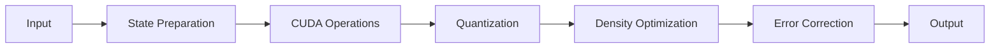

# QRAF API Service Implementation Plan

## Overview

This document outlines the architecture and implementation plan for exposing QRAF's quantum-enhanced capabilities as a FastAPI service, with CUDA acceleration, quantization, density optimization, error correction, and state network integration.

## Architecture Components

### 1. API Layer (FastAPI)
```python
# Core endpoints
POST /enhance      # Enhanced text generation
POST /memory      # Memory operations
POST /state       # State management
GET  /health      # Service health
GET  /metrics     # Performance metrics

# Advanced endpoints
POST /optimize    # Density optimization
POST /correct     # Error correction
POST /quantize    # State quantization
```

### 2. Acceleration Layer
```python
class CUDAAccelerator:
    # From cuda_utils
    - Fused attention operations
    - Parallel state processing
    - Memory-efficient gradients
    - Batch quantum operations
```

### 3. State Management
```python
class QuantumStateManager:
    # Core components
    - CompressiveMemory integration
    - Phase coherence tracking
    - Interference pattern management
    - State network routing
```

### 4. Processing Pipeline


## Implementation Approaches

### Approach 1: Monolithic Service
- **Pros:**
  - Simpler deployment
  - Direct memory access
  - Lower latency
- **Cons:**
  - Less scalable
  - Higher resource usage
  - Harder to update

### Approach 2: Microservices
- **Pros:**
  - Independent scaling
  - Isolated resources
  - Easy updates
- **Cons:**
  - Complex orchestration
  - Higher network overhead
  - State synchronization challenges

### Approach 3: Hybrid (Recommended)
- **Core service:** FastAPI + CUDA
- **Auxiliary services:** Optimization, Error Correction
- **Shared:** State Network, Memory Management
```python
# Architecture
CoreService:
    - FastAPI endpoints
    - CUDA operations
    - State management
    - Memory compression

OptimizationService:
    - Density optimization
    - Quantization
    - Batch processing

ErrorCorrectionService:
    - State correction
    - Coherence maintenance
    - Phase alignment

StateNetworkService:
    - State routing
    - Network topology
    - Path optimization
```

## Performance Optimizations

### 1. CUDA Acceleration
```python
@cuda_optimized
class QuantumOperations:
    def fused_attention(self, states):
        # Fused QKV projection
        # Optimized memory access
        # Parallel processing

    def batch_quantize(self, states):
        # Parallel quantization
        # Shared memory usage
        # Warp-level operations
```

### 2. Memory Management
```python
class MemoryManager:
    def compress_states(self):
        # Quantum compression
        # Phase preservation
        # Coherence tracking

    def optimize_density(self):
        # Matrix optimization
        # Eigenvalue adjustment
        # Trace preservation
```

### 3. Error Correction
```python
class ErrorCorrector:
    def correct_state(self):
        # Surface code correction
        # Stabilizer measurements
        # Syndrome detection
```

## Scaling Strategy

### 1. Horizontal Scaling
- State partitioning
- Load balancing
- Session affinity

### 2. Vertical Scaling
- GPU memory optimization
- Batch size adaptation
- Resource allocation

### 3. Network Optimization
- State routing
- Path compression
- Topology awareness

## Security Measures

### 1. Authentication
- API keys
- JWT tokens
- Rate limiting

### 2. State Protection
- Encryption at rest
- Secure state transfer
- Memory isolation

### 3. Access Control
- Role-based access
- Resource quotas
- Usage tracking

## Implementation Phases

### Phase 1: Core Infrastructure
1. FastAPI setup
2. CUDA integration
3. Basic state management
4. Health monitoring

### Phase 2: Enhanced Features
1. Density optimization
2. Error correction
3. State network
4. Advanced metrics

### Phase 3: Scaling & Optimization
1. Load balancing
2. Auto-scaling
3. Performance tuning
4. Security hardening

## Performance Metrics

### 1. Latency
- Request processing time
- State transformation speed
- Network overhead

### 2. Throughput
- Requests per second
- State operations per second
- Memory operations per second

### 3. Resource Usage
- GPU utilization
- Memory consumption
- Network bandwidth

## Monitoring & Logging

### 1. Service Health
- Endpoint availability
- Error rates
- Resource utilization

### 2. State Metrics
- Coherence levels
- Compression ratios
- Error correction rates

### 3. Performance Tracking
- Operation latencies
- Resource efficiency
- Scaling events

## Deployment Strategy

### 1. Container Orchestration
```yaml
services:
  core:
    image: qraf-core
    gpu: true
    scaling:
      min: 1
      max: 10
  
  optimization:
    image: qraf-opt
    gpu: true
    scaling:
      min: 1
      max: 5
```

### 2. Resource Management
- GPU allocation
- Memory limits
- Network policies

### 3. Update Strategy
- Rolling updates
- Blue-green deployment
- Canary releases

## Next Steps

1. **Immediate Actions**
   - Set up FastAPI project structure
   - Integrate CUDA utilities
   - Implement core state management

2. **Short-term Goals**
   - Basic endpoint functionality
   - CUDA acceleration integration
   - Initial performance testing

3. **Long-term Goals**
   - Full feature implementation
   - Scaling infrastructure
   - Production deployment

## Conclusion

The hybrid approach offers the best balance of performance, scalability, and maintainability. By leveraging our existing CUDA optimizations and quantum processing capabilities while adding FastAPI's modern web framework features, we can create a robust and efficient API service that maintains the security of our core IP while providing valuable capabilities to clients. 